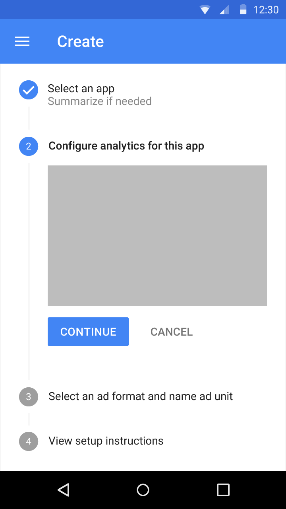

# Belatrix Test Solution
This is the solution for the test for the Belatrix application.

## Task 1: Material Design Stepper
>Propón los pasos, clases, layouts y recursos que utilizarías para hacer un Stepper
reutilizable y que cumpla con los parámetros definidos en la guía de [material design](https://material.io/guidelines/components/steppers.html)


### Solution
First of all this is a huge task. So I'll put here 2 different ways to implement a stepper.


#### 1. Using a third party library
This in in my perspective the is best way (faster and simple) to build a material design stepper, cause as I've said before, this would be a really head each.

There are a lot of libraries out there in order to build a stepper, libraries which cover even different types
of steppers, like :

- Horizontal Steppers
- Vertical Steppers
- Linear Steppers

and more.

Libraries like the following are good options:
- [Baoyachi StepView](https://github.com/baoyachi/StepView)
- [StepStoneTech Material Stepper](https://github.com/stepstone-tech/android-material-stepper)

#### 2. Building from 0 a Material stepper
I can't find a way where I could decide to pick to go with this option.

1. We need to build 1 view alternating the different states, one for the inactive items and other for the active item following the guidelines that you can read below.

  * Active Stepper View
    - Circle
      - 24dp x 24dp
      - 12sp Roboto Regular
      - Inherits primary color
      - Default color is Google Blue 500
    - Active Step
      - 14sp Roboto Medium
      - 87% black
    - Connector line
      - 1dp border
      - Grey 400 color value


  * Inactive Stepper View
    - Circle
      - 24dp x 24dp
      - 12sp Roboto Regular
      - Color 100% white
      - Background 38% black
    - Inactive Step
      - 14sp Roboto Regular
      - 38% black

2. The connector line can be easily implemented as a different view, with 0 top padding and 16dp of bottom padding.

3. Build the content that will go inside each step when is active as you'll see in the following image.



This content can be pretty simple. A text indicating some information or an edit text, and  two buttons, the continue button (RaisedButton) and the cancel button which will redirect you to the previous step (FlatButton), finally this item needs a larger connector line, a simple View item with the background color indicated in the guidelines.

4. Time to put everything together.

    The way I would implement all the pieces together would be using an [Expandable recyclerview](https://github.com/thoughtbot/expandable-recycler-view) alternating between the active steps and the connector line and each piece of content as the children view and finally implementing the onclick listener for each of the buttons.

## Task 2: OnShake do something
> Crea un shake action en android y pon el código.


1. For this task I made use of the ```SensorManager``` class built-in android and implementing the ```SensorEventListener``` Interface in order to detect when the accelorementer sensor is triggered, registering the listener to the SensorManager in onResume and unregistering in OnPause.

```
public class MainActivity extends AppCompatActivity implements SensorEventListener {

  private SensorManager sensorManager;
     private static final int SHAKE_THRESHOLD = 600;
     private long lastUpdate = 0;

     private float last_x = 0;
     private float last_y = 0;
     private float last_z = 0;

     @Override
     protected void onCreate(Bundle savedInstanceState) {
         super.onCreate(savedInstanceState);
         setContentView(R.layout.activity_main);
         sensorManager = (SensorManager) getSystemService(SENSOR_SERVICE);

     }

      @Override
      protected void onResume() {
          super.onResume();
          sensorManager.registerListener(this,
                        sensorManager.getDefaultSensor(Sensor.TYPE_ACCELEROMETER),
                        SensorManager.SENSOR_DELAY_GAME);
      }

      @Override
      protected void onPause() {
          super.onPause();
          sensorManager.unregisterListener(this);
      }

```


2. Then, I declared a threshold ```private static final int SHAKE_THRESHOLD = 600;``` for a min shake speed.

3. Finally, I Implemented the code in the Overrided method ```onSensorChanged``` from the interface implemented.
  - Detect if the sensor triggered was the accelerometer.
  - get the actual time, and if the difference between the two movements is greater than 100 ms, continue.
  - get x, y, and z values of movement from the accelerometer.
  - Calculate the speed and compare it to the threshold declared before.
  - Throw an action that in this case is a debug log and simple toast indicating the speed.
  - Finally re assigning x, y, and z to the global variables.

```
@Override
  public void onSensorChanged(SensorEvent event) {
      if (event.sensor.getType() == Sensor.TYPE_ACCELEROMETER) {
          long currentTImeMillis = System.currentTimeMillis();
          // only allow one update every 100ms.
          if ((currentTImeMillis - lastUpdate) > 100) {
              long diffTime = (currentTImeMillis - lastUpdate);
              lastUpdate = currentTImeMillis;

              float x = event.values[SensorManager.DATA_X];
              float y = event.values[SensorManager.DATA_Y];
              float z = event.values[SensorManager.DATA_Z];

              float speed = Math.abs(x + y + z - last_x - last_y - last_z) / diffTime * 10000;

              if (speed > SHAKE_THRESHOLD) {
                  Log.d("sensor", "shake detected w/ speed: " + speed);
                  Toast.makeText(this, "shake detected w/ speed: " + speed, Toast.LENGTH_SHORT).show();
              }
              last_x = x;
              last_y = y;
              last_z = z;
          }
      }
  }

```
4. Visual Example

## Task 3: MVP + Clean Architecture
>Explica cómo organizas en base a tu experiencia un proyecto en Android utilizando MVP e
implementando Clean Architecture, menciona los paquetes que utilizarías y la distribución de
módulos.

## Task 4: Compass Custom View
>Diseña un custom view de una brújula utilizando canvas y pon el código que utilizarías en
esta sección.

For this task also there are a lot of libraries like [Compass-view](https://github.com/arbelkilani/Compass-View) that can save us a lot of hours or even days of work.

Custom View steps:

1. First I created the class CompassView and extended this class from View.
2. Declared some global variables like the direction of the compass and 2 Paint objects.

```
public class CompassView extends View {

    private Paint mPaintCircle;
    private Paint mPaintLine;
    private float direction;
```
3. I created an init method which will be used to initiate our view in each of the 4 constructors implemented from the view class.

  - Initializing the circle Paint object and setting the color to gray.
  - Initializing the line Paint object and setting the color to red and a stroke width of 6.

```
private void init(@Nullable AttributeSet attributeSet) {
        mPaintCircle = new Paint(Paint.ANTI_ALIAS_FLAG);
        mPaintCircle.setColor(Color.GRAY);

        mPaintLine = new Paint(Paint.ANTI_ALIAS_FLAG);
        mPaintLine.setColor(Color.RED);
        mPaintLine.setStrokeWidth(6);
    }
```

4. Implemented the 4 constructors.

```
public CompassView(Context context) {
     super(context);
     init(null);
 }

 public CompassView(Context context, AttributeSet attrs) {
     super(context, attrs);
     init(attrs);
 }

 public CompassView(Context context, AttributeSet attrs, int defStyleAttr) {
     super(context, attrs, defStyleAttr);
     init(attrs);
 }

 @RequiresApi(api = Build.VERSION_CODES.LOLLIPOP)
 public CompassView(Context context, AttributeSet attrs, int defStyleAttr, int defStyleRes) {
     super(context, attrs, defStyleAttr, defStyleRes);
     init(attrs);
 }
```

5. Override OnDraw method.
  - make the calculations required for the space available to draw a circle.
  - in this line ```canvas.drawCircle(cx, cy, radius, mPaintCircle); ``` the circle was drawn with the center x, center y, radius, and the Paint initiated before.
  - Finally the line is drew and updated based on the direction value, which is the north of the compass.

```
  @Override
   protected void onDraw(Canvas canvas) {
       super.onDraw(canvas);

       int w = getWidth();
       int h = getHeight();

       int pl = getPaddingLeft();
       int pr = getPaddingRight();
       int pt = getPaddingTop();
       int pb = getPaddingBottom();

       int usableWidth = w - (pl + pr);
       int usableHeight = h - (pt + pb);

       int radius = Math.min(usableWidth, usableHeight) / 2;
       int cx = pl + (usableWidth / 2);
       int cy = pt + (usableHeight / 2);

       canvas.drawCircle(cx, cy, radius, mPaintCircle);

       int mw = getMeasuredWidth();
       int mh = getMeasuredHeight();
       canvas.drawLine(
               mw/2,
               mh/2,
               (float)(w/2 + radius * Math.sin(-direction)),
               (float)(h/2 - radius * Math.cos(-direction)),
               mPaintLine);

   }
```

6.  update the direction and redraw the view using invalidate().

```
public void update(float dir){
        direction = dir;
        invalidate();
    }
```

At this time maybe you are thinking, that was so simple, and yes it was, I haven't had the neccesity to build a custom-view on my own, due to out there you can find almost a library for each thing you can think about.

So, I decided to implement the compass functionallity too, based on the accelerometer and magnetic field sensor.

```
@Override
 public void onSensorChanged(SensorEvent event) {
     switch (event.sensor.getType()) {
         case Sensor.TYPE_ACCELEROMETER:
             // This array copy is like a for ... [0,3]
             System.arraycopy(event.values, 0, valuesAccelerometer, 0, 3);
             break;
         case Sensor.TYPE_MAGNETIC_FIELD:
             System.arraycopy(event.values, 0, valuesMagneticField, 0, 3);
             break;
     }
     boolean success = SensorManager.getRotationMatrix(
             matrixR,
             matrixI,
             valuesAccelerometer,
             valuesMagneticField);
     if (success) {
         SensorManager.getOrientation(matrixR, matrixValues);
         compass.update(matrixValues[0]);
     }
 }
```

Visual Example:
